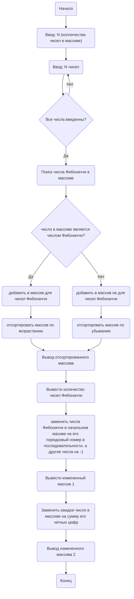

## Отчет по лабораторной работе № 2

#### № группы: `ПМ-2403`

#### Выполнила: `Шашина Софья Андреевна`

#### Вариант: `23`

### Cодержание:

- [Постановка задачи](#1-постановка-задачи)
- [Входные и выходные данные](#2-входные-и-выходные-данные)
- [Выбор структуры данных](#3-выбор-структуры-данных)
- [Алгоритм](#4-алгоритм)
- [Программа](#5-программа)
- [Анализ правильности решения](#6-анализ-правильности-решения)

### 1. Постановка задачи
> Программа работает с одномерным массивом натуральных чисел. 
>1. Считать с консоли число N, затем N целых чисел и заполняет массив размером N.
>2. Разместить числа в массиве таким образом, чтобы числа, являющиеся числами Фибоначчи, находились в начале массива в порядке возрастания, а остальные числа — в конце массива в порядке убывания.
>3. Найти и вывести количество чисел Фибоначчи в массиве.
>4. Вывести элементы массива, заменяя числа Фибоначчи на порядковый номер в последовательности, а остальные числа — на -1.
>5. Заменить каждое число в массиве на сумму его нечётных цифр и вывести полученный массив.


### 2. Входные и выходные данные
#### Данные на вход
|             | Тип         | min значение    | max значение   |
|-------------|-------------|-----------------|----------------|
| N (размер массива) | Целое | 1  | 2*10 <sup> 9</sup> |
| N чисел | Целые | 1 |  2*10 <sup> 9</sup> |


#### Данные на выход
- Количество числе Фибоначчи в массиве;
- Элементы массива, где числа Фибоначчи заменены на порядковый номер в последовательности.
- Отсортированный массив, числа фибоначчи в начале массива в порядке возрастания, остальные числа в конце в порядке убывания
- Массив, где каждое число заменено на сумму его нечетных цифр.

### 3. Выбор структуры данных
Для решения задачи используются:

-  Одномерные массивы: для чисел Фибоначчи, остальных чисел, для порядковых номеров Фибоначчи или -1;
-  Переменная для хранения порядково номера числа Фибоначчи;
-  Переменная для количества чисел Фибоначчи;
-  Переменные для нахождения чисел Фибоначчи;
-  boolean Fibonacci для нахождения чисел Фиббоначи;
-  Переменные для нахождения порядкового номера, четных цифр, суммы четных цифр(типа int);

### 4. Алгоритм
#### Алгоритм выполнения программы:
1. Считать число  N
2. Создать массив из N чисел.
3. Цикл для поиска чисел Фибоначчи: если число Фибоначчи найденно в массиве, то  добавить в массив для чисел Фибоначчи; остальные числа из массива добавить в массив не для чисел Фибоначчи.
4. Отсортировать массивы с помощью циклов for.
5. Вывести отсортированный массив.
6. Вывод количества чисел Фибоначчи в массиве.
7. Цикл для замены чисел Фибоначчи на его порядковый номер, а не чисел Фибоначчи на -1
8. Вывод заменяных чисел.
9. Замена каждого числа на сумму его четных цифр.
10. Вывод измененного массива.

#### Блок-схема

### 5. Программа
```java
import java.io.PrintStream;
import java.util.Scanner;
public class Main {
    public static Scanner in = new Scanner(System.in);
    public static PrintStream out = System.out;
    public static void main(String[] args) {
        // Считываем количество чисел
        out.print("Введите число N: ");
        int N = in.nextInt();
        int []num=new int[N];
        out.println("Введите " + N + " натуральных числа:");
        //создаем массив из N чисел
        for (int i = 0; i < N; i++) {
            num[i] = in.nextInt();
        }
        // массив для чисел Фибоначчи
        int[] fibn = new int[N];
        // масив для чисел, которыми не являются числами Фибоначчи
        int[] notfib = new int[N];
        //массив, где элементы будут поменяны на порядковый номер или на -1
        int[] zamena= new int[N];
        //счетчик для чисел Фибоначчи
        int fibc = 0;
        //счетчик не для чисел Фибоначчи
        int notfibc = 0;
        // Считывание и классификация чисел
        for (int i = 0; i < N; i++) {
            int number = num[i];
            int a = 0, b = 1;//начальные значения для чисел Фибоначчи
            boolean fibonacci=false;//флажок для поиска числа Фибоначчи в массиве
            if (number==a || number==b){//если число равно начальным значениям Фибоначчи
                fibonacci = true;// то число Фибоначчи найдено
            }
            while (b < number) {
                int c=b;//идем дальше по циклу
                b+=a;
                a=c;
                if(b==number){
                    fibonacci=true;
                    break;
                }
            }
            if (fibonacci) {//если число Фибоначчи найдено в массиве
                fibn[fibc++] = number;//формируем массив из чисел Фибоначчи(это нужно для дальнейших действий)
            }
            else {
                notfib[notfibc++] = number;//если число не является числом Фибоначчи, создаем для таких чисел массив
            }
        }
        //Отсортировываем массив с числами Фибоначчи по возрастанию
        for (int i = 0; i < fibc - 1; i++) {
            for (int j = 0; j < fibc - i - 1; j++) {
                if (fibn[j] > fibn[j + 1]) {
                    // Меняем местами
                    int f = fibn[j];
                    fibn[j] = fibn[j + 1];
                    fibn[j + 1] = f;
                }
            }
        }
        //Отсортировываем массив не с числами Фибоначчи по убыванию
        for (int i = 0; i < notfibc - 1; i++) {
            for (int j = 0; j < notfibc - i - 1; j++) {
                if (notfib[j] < notfib[j + 1]) {
                    //меняем местами
                    int f = notfib[j];
                    notfib[j] = notfib[j + 1];
                    notfib[j + 1] = f;
                }
            }
        }
        // Вывод конечного отсортированного массива для пункта 2
        out.println("Отсортированный массив по возрастанию/убыванию:");
        for (int i = 0; i < fibc; i++)
            out.print(fibn[i] + " ");
        for (int i = 0; i < notfibc; i++)
            out.print(notfib[i] + " ");
        out.println();
        out.println("Количество чисел Фибоначчи: " + fibc);//вывод количества чисел Фибоначчи
        for (int i = 0; i < N; i++) {
            int numbers = num[i];
            int a = 0, b = 1, index = 0;
            // Проверка на число Фибоначчи для поиска порядкового номера в последовательности Фибоначчи
            if (numbers == a) {
                zamena[i] = index+1;//в новый массив добавляем порядковый номер для 0
            } else if (numbers == b) {
                zamena[i] = index + 2;//в новый массив добавляем порядковый номер для 1
            } else {
                index += 2;
                while (b <= numbers) {
                    if (b == numbers) {
                        zamena[i] = index;
                        break;
                    }
                    int temp = b;
                    b += a;
                    a = temp;
                    index++;
                }
                if (b > numbers) {
                    zamena[i] = -1; // Не является числом Фибоначчи
                }
            }
        }
        // Вывод элементов массива, где числа Фибоначчи заменились на порядковый номер, а остальные числа на -1
        out.println("Вывод элементов массива, где числа Фибоначчи заменились на порядковый номер, а остальные числа на -1:");
        for (int i = 0; i < N; i++) {
            out.print(zamena[i] + " ");
        }
        out.println();
        //  Замена каждого числа на сумму его четных цифр
        for (int i = 0; i < N; i++) {
            int sum = 0;
            int t = num[i];
            while (t> 0) {
                int digit = t % 10;
                if (digit % 2 == 0) {
                    sum += digit;
                }
                t /= 10;
            }
            num[i] = sum;
        }
        // Вывод полученного массива, где каждое число заменилось на сумму его нечетных цифр
        out.println("Массив, где каждое число заменилось на сумму его нечетных цифр:");
        for (int i = 0; i < N; i++) {
            out.print(num[i] + " ");
        }
    }
}

```
### 6. Анализ правильности решения
Программа успешно выполняет поставленные задачи.
1. Тест:
    - **Input**:
        ```
        10
        11 88 47 35 55 5 3 1 13 90
        ```

    - **Output**:
        ```
         Отсортированный массив по возрастанию/убыванию:
         1 3 5 13 55 90 88 47 35 11 
         Количество чисел Фибоначчи: 5
         Вывод элементов массива, где числа Фибоначчи заменились на порядковый номер, а остальные числа на -1:
         -1 -1 -1 -1 11 6 5 2 8 -1 
         Массив, где каждое число заменилось на сумму его нечетных цифр:
         0 16 4 0 0 0 0 0 0 0 
        
        ```
